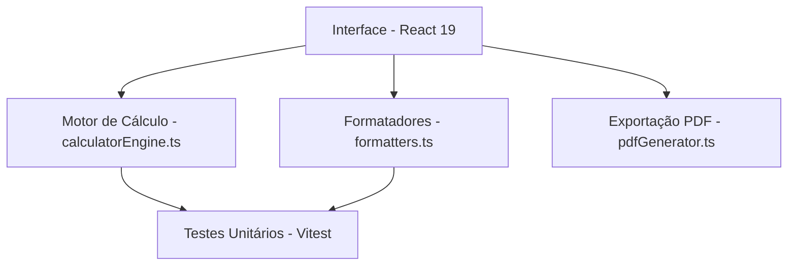

# 🏙️ Calculadora de Fluxo de Pagamento - Infinity 87

Aplicação web para simulação, estruturação e visualização do **fluxo financeiro de aquisições imobiliárias** até a entrega das chaves, com geração de proposta em PDF e validação automatizada de parcelas.

---

## 🎯 Categorias de Lançamento

O sistema permite calcular e consolidar as seguintes modalidades de pagamento:
1. **Sinal de Reserva**: Aporte único inicial de adesão.
2. **Entrada**: Pagamento em dinheiro ou bens (veículo, imóvel, serviço).
3. **Parcelas Intermediárias**: Lançamentos recorrentes (mensais, trimestrais, semestrais ou anuais).
4. **Saldo de Chaves**: Montante final devido na entrega das chaves.

---

## 📐 Estrutura do Projeto

Separado rigorosamente entre o motor de cálculo puro e a camada de interface gráfica:



### 🧩 Módulos

- **`src/utils/calculatorEngine.ts`**: Motor puro e determinístico responsável pelos cálculos do fluxo, geração do cronograma e classificação temporal em relação à data de chaves.
- **`src/components/Calculator/CalculatorMain.tsx`**: Orquestrador do fluxo assistido em 3 etapas (1. Configuração -> 2. Lançamentos -> 3. Resultado & PDF).
- **`src/components/Calculator/PaymentForm.tsx`**: Gestão visual dos lançamentos em cards e assistente de cadastro.
- **`src/components/Calculator/MonthYearInput.tsx`**: Seletor de mês/ano otimizado para dispositivos móveis (evita bloqueios no iOS e zoom automático).
- **`src/utils/formatters.ts`**: Formatadores de moeda BRL e datas BR (`DD/MM/AAAA` / `MM/AAAA`).
- **`src/utils/pdfGenerator.ts`**: Gerador de relatório técnico em PDF via `html2canvas` (2x) + `jsPDF`.

---

## 🧪 Testes Unitários (Vitest)

A aplicação conta com testes unitários cobrindo o motor de cálculo e os formatadores:

```bash
# Executar a suíte de testes
pnpm test
```

### Cobertura dos Testes:
- **`calculatorEngine.test.ts`**: Valida a geração de cronogramas, periodicidades, cálculo de percentual pago até a entrega e chave de alternância das chaves.
- **`formatters.test.ts`**: Valida parsing e formatação de moeda BRL e conversões de datas.

---

## 🚀 Instalação e Execução

### Pré-requisitos
- **Node.js**: `v18+`
- **pnpm**: `v9+`

### Comandos

```bash
# Instalar dependências
pnpm install

# Servidor de desenvolvimento
pnpm dev

# Executar testes unitários
pnpm test

# Build de produção
pnpm build
```
