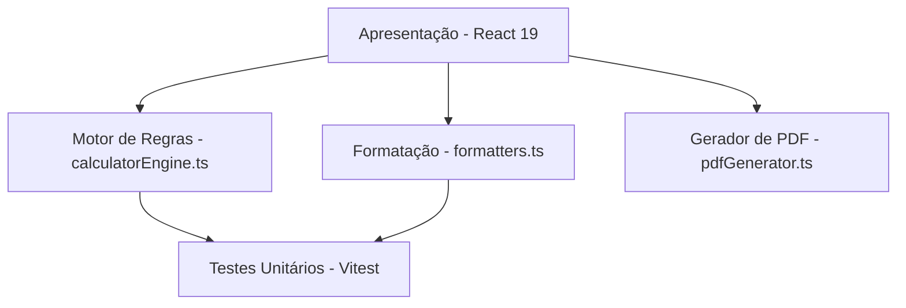

# 🏙️ Calculadora de Fluxo de Pagamento - Infinity 7

> **Fundamentação Clean Code (Robert C. Martin)**: 
> *"O código é a documentação viva e primária do sistema. A documentação externa não deve tentar explicar o que o código já deixa óbvio, mas sim o **porquê** das decisões de arquitetura, as **fronteiras do domínio de negócio** e os **invariantes** do sistema."*

---

## 🎯 Objetivo & Domínio de Negócio

Esta aplicação tem como objetivo simular, estruturar e visualizar o **fluxo financeiro para aquisição imobiliária** até a data limite da **entrega das chaves**.

No mercado imobiliário, os pagamentos são divididos em categorias distintas antes do habite-se/chaves:
1. **Sinal de Reserva**: Pagamento único inicial de adesão.
2. **Entrada**: Aporte inicial em dinheiro ou bens (veículo, imóvel, serviço).
3. **Parcelas Intermediárias**: Pagamentos recorrentes (mensais, trimestrais, semestrais ou anuais) corrigidos até as chaves.
4. **Saldo de Chaves**: Montante final devido no momento do recebimento das chaves.

---

## 📐 Arquitetura & Separação de Responsabilidades (SRP)

A arquitetura do projeto segue a separação estrita entre o **Motor de Regras de Negócio** e a **Camada de Apresentação (UI)**:



### 🧩 Módulos Principais

- **`src/utils/calculatorEngine.ts` (Core de Negócio)**
  - *Função pura e determinística*. 
  - Não possui dependências com o React ou com a árvore de renderização DOM.
  - Orquestra o cálculo do fluxo (`calculatePaymentFlow`), gera o cronograma individual de parcelas (`generateInstallmentsFromItem`) e classifica o que vence estritamente antes ou depois da entrega das chaves.

- **`src/components/Calculator/` (Camada de Interface)**
  - **`CalculatorMain.tsx`**: Orquestrador de fluxo em 3 etapas (1. Configuração -> 2. Lançamentos -> 3. Resultado & PDF).
  - **`PaymentForm.tsx`**: Gestão visual de lançamentos baseada em cards (`PaymentItemCard`) e assistente em etapas (`InlinePaymentWizard`).
  - **`ConfigForm.tsx`**: Entrada de dados da proposta global.
  - **`MonthYearInput.tsx`**: Campo nativo de seleção de mês/ano otimizado para mobile com overlay de toque direto (prevenindo bloqueios do iOS Safari e zoom automático).

- **`src/utils/formatters.ts` (Formatadores e Máscaras)**
  - Trata conversões de valores monetários BRL (sem centavos para limpeza visual) e datas no padrão brasileiro (`DD/MM/AAAA` e `MM/AAAA`).

- **`src/utils/pdfGenerator.ts` (Exportação)**
  - Constrói a folha de proposta técnica em um container fora da tela, utilizando `html2canvas` (escala 2x para alta definição) e `jsPDF` em página única.

---

## 🧪 Testes como Especificação (Vitest)

Segundo o livro *Clean Code*, os testes unitários funcionam como a **especificação técnica viva** das regras do sistema.

### Como Executar os Testes Unitários:

```bash
# Executar a suíte completa de testes
pnpm test
```

### O que é coberto pelos testes:
- **`calculatorEngine.test.ts`**:
  - Geração precisa de cronogramas de parcelas para todas as periodicidades (mensal, trimestral, semestral, anual).
  - Classificação temporal de parcelas em relação ao mês da entrega das chaves (`isBeforeKeys`).
  - Cálculo percentual e inclusão/exclusão opcional do Saldo de Chaves.
- **`formatters.test.ts`**:
  - Parsing de strings monetárias BRL e conversões de datas ISO para padrão BR.

---

## 🚀 Como Executar o Projeto

Este projeto utiliza estritamente o gerenciador de pacotes **`pnpm`**.

### Pré-requisitos
- **Node.js**: `v18+`
- **pnpm**: `v9+`

### Comandos Principais

```bash
# 1. Instalar dependências
pnpm install

# 2. Executar o servidor de desenvolvimento
pnpm dev

# 3. Executar os testes unitários
pnpm test

# 4. Validar o build de produção (TypeScript + Vite)
pnpm build
```

---

## 💎 Boas Práticas & Limpeza de Código Aplicadas

1. **Nomes Expressivos**: Variáveis e funções revelam intenção imediata (`generateInstallmentsFromItem`, `totalPaidBeforeKeys`, `isBeforeKeys`).
2. **Funções Pequenas e Focadas**: Cada função executa uma única tarefa abstrata.
3. **Ausência de Efeitos Colaterais (Side-Effect Free Engine)**: O motor de cálculo é totalmente desacoplado da UI, permitindo execução isolada instantânea nos testes.
4. **Solo Virtual Eficiente**: Construído com TypeScript, Vite e Vanilla CSS para mínima sobrecarga de CPU e RAM.
